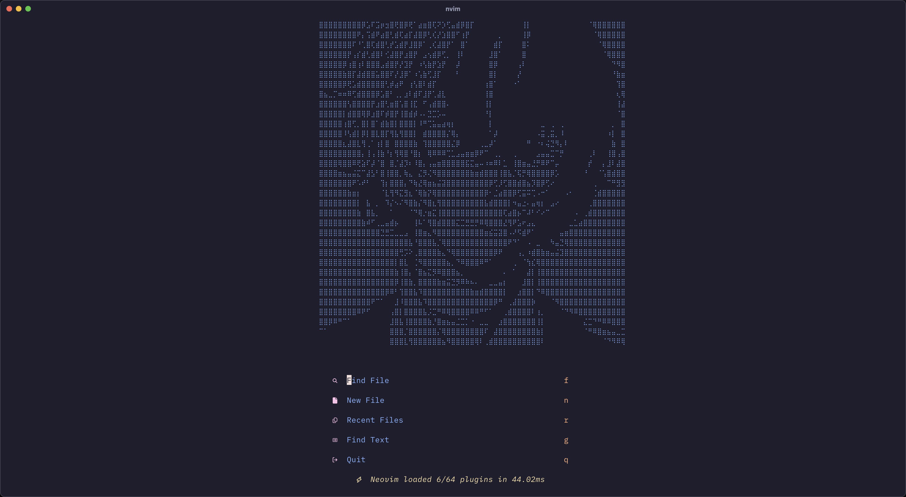

## Why another neovim configuration?

I have been using Neovim for a long time and I have tried many configurations. I have learned a lot from them and I have decided to create my own configuration. This configuration is inspired by LazyVim and other configurations (kickstart.nvim, nvchad/tinyvim) and I have added my own ideas to it.

## Install Neovim

```sh
brew install neovim
```

## Usage

```sh
git clone https://github.com/oca159/lazyvim.git ~/.config/nvim
```

## Bubble Sort Example (Ruby)

```ruby
def bubble_sort(arr)
  n = arr.length
  loop do
    swapped = false
    (n-1).times do |i|
      if arr[i] > arr[i+1]
        arr[i], arr[i+1] = arr[i+1], arr[i]
        swapped = true
      end
    end
    break unless swapped
  end
  arr
end

# Example usage:
# numbers = [64, 34, 25, 12, 22, 11, 90]
# sorted_numbers = bubble_sort(numbers)
# puts sorted_numbers
```

## Bubble Sort Example (Python)

```python
def bubble_sort(arr):
    n = len(arr)
    for i in range(n):
        swapped = False
        for j in range(0, n - i - 1):
            if arr[j] > arr[j + 1]:
                arr[j], arr[j + 1] = arr[j + 1], arr[j]
                swapped = True
        if not swapped:
            break
    return arr

# Example usage:
# numbers = [64, 34, 25, 12, 22, 11, 90]
# sorted_numbers = bubble_sort(numbers)
# print(sorted_numbers)
```
